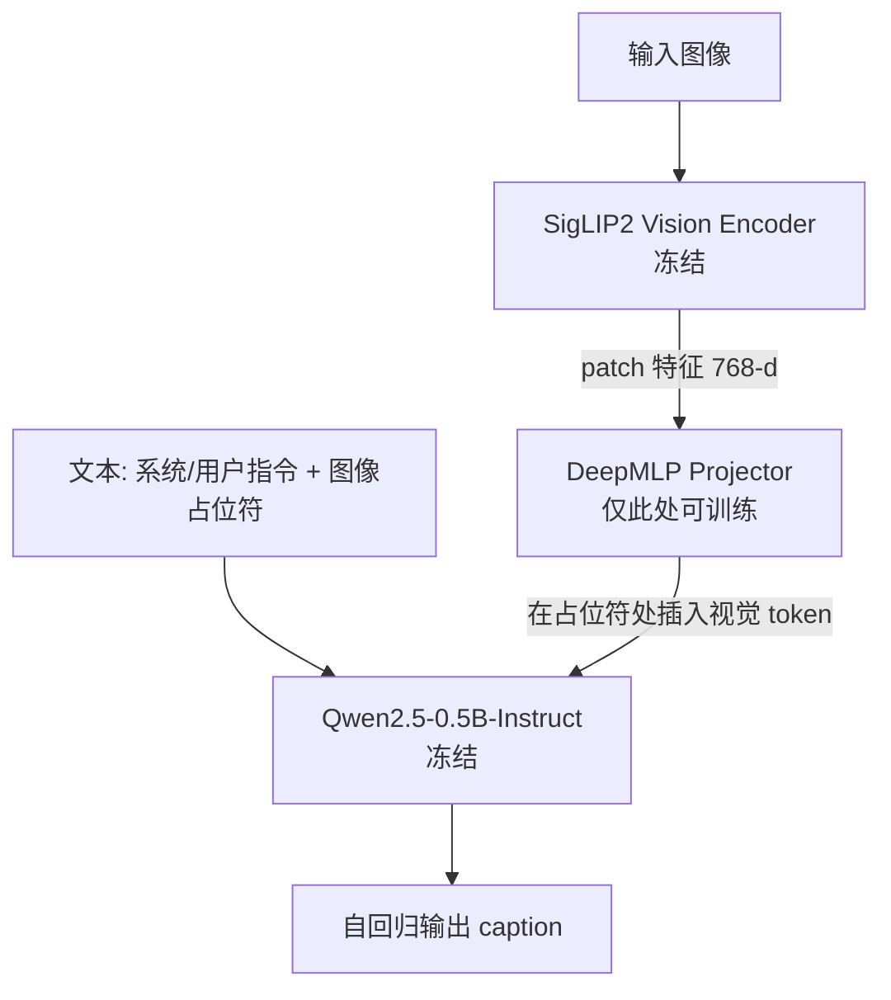
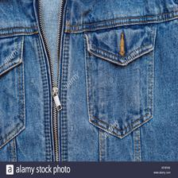
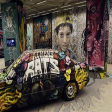
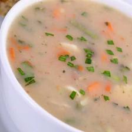

# Stage 2：图像条件语言模型（只训 Projector）

## 任务定义

本阶段训练 **以图像为条件** 的文本续写/描述能力，采用 **image-conditioned language modeling** 设定：

- **冻结** 视觉编码器与 LLM，仅 **训练投影器（Projector）**，将视觉特征映射到与 LLM 词嵌入对齐的空间。
- 数据为 **纯 caption/描述** 监督（本仓库默认 `LLaVA-CC3M-Pretrain` 风格 `chat.json` 路径），**不做问答（QA）**。
- 输入侧使用 **自然续写式前缀/指令**（如 *Give a short and clear explanation…* 等，与 `caption_dataset` 模板一致），在序列中用占位符与视觉 token 融合后自回归生成描述。
- 训练期可重点看 **validation loss、BLEU-4** 等做快速反馈；正式评测可看 **BLEU-n、ROUGE-L、CIDEr**（本仓库实测中 **METEOR** 常为占位 0，见 `评测结果.txt`）以及 **人工或 LLM-as-a-Judge**。

> 与简单 MLP 相比，过深的 MLP 易出现 **梯度消失**；本配置采用 **输入 LayerNorm → 三层线性 DeepMLP → 输出 LayerNorm** 的 `DeepMLPProjector`（见 `models/projector.py`）。

## 模型结构



**组件对应关系**（与 `config/training_stage2.yaml` 一致）：

| 模块 | 默认配置 |
|------|-----------|
| 视觉 | `google/siglip2-base-patch16-224`，`freeze: true` |
| LLM | `Qwen/Qwen2.5-0.5B-Instruct`，`freeze: true` |
| 投影 | `type: deepmlp`，768 → `hidden_size`，带 dropout |
| 融合 | 在 `input_ids` 中 `image_pad_id` 处用投影后的视觉向量替换，再前向/生成 |

## 环境

```bash
pip install -r requirements.txt
```

## 数据准备

按 `config/training_stage2.yaml` 中的 `chat_json_path` 与 `image_root` 准备数据，并执行（若仓库中已有脚本）：

```bash
python data/download_data.py
```

## 训练命令

使用默认配置从头训练：

```bash
python train.py --config config/training_stage2.yaml
```

从检查点续训（例如中断后恢复）：

```bash
python train.py --config config/training_stage2.yaml --resume /path/to/checkpoint.pt
```

主要超参在 `config/training_stage2.yaml` 中，例如 `epochs`、`save_steps`、`eval_steps`、学习率、batch 大小与 `model.projector.type` 等。

## 评测命令

**自动指标（测试集生成 + BLEU / ROUGE-L / CIDEr；METEOR 视环境是否真正计算而定）**：

```bash
python eval.py --config config/training_stage2.yaml --resume outputs/best_checkpoint.pt
```

仅快速冒烟（前若干个 batch）：

```bash
python eval.py --config config/training_stage2.yaml --resume outputs/best_checkpoint.pt --limit_batches 20
```

在 GPU 上可用半精度加速（若设备支持）：

```bash
python eval.py --config config/training_stage2.yaml --resume outputs/best_checkpoint.pt --dtype fp16 --batch_size 128
```

**LLM-as-a-Judge（Qwen-VL-Max 等多维打分）** — 需配置阿里云 DashScope，将 API Key 置于环境变量（推荐）：

```bash
export DASHSCOPE_API_KEY=your_key_here
```

对当前 checkpoint 跑推理 + 评判：

```bash
python eval_judge.py \
  --config config/training_stage2.yaml \
  --checkpoint outputs/best_checkpoint.pt \
  --judge_model qwen-vl-max \
  --output_json outputs/judge_results.json \
  --limit 100
```

仅对已保存的预测 JSON 做评判（不重复推理）：

```bash
python eval_judge.py \
  --predictions_json outputs/test_predictions.json \
  --image_root ./data/llava_cc3m_raw/images \
  --judge_model qwen-vl-max \
  --output_json outputs/judge_results.json \
  --limit 100
```

**第三方 LLaVA-HF 基线**（与仓库中 `eval_llava.py` 等脚本一致，具体参数以该脚本 `argparse` 为准）可在相同测试协议下对比，生成如 `outputs/llava-onevision-qwen2-0.5b-ov-hf_test_predictions.json` 等结果。

## 结果表

下列数值摘自仓库内 **`评测结果.txt`**（自训模型与 `eval.py` 一致；HF LLaVA 段见文末）。自训 checkpoint 评测中 **METEOR 未实际计算**（日志中为 0.0000），故 **自训模型表** 与下方 LLaVA 表的主列 **均不列出 METEOR**（HF 侧的 METEOR 仍可在 `评测命令.txt` / `评测结果.txt` 原文查看）。

**全量 test 集**上的自动指标：

| 设置 | BLEU-1 | BLEU-2 | BLEU-3 | BLEU-4 | ROUGE-L | CIDEr |
|------|--------|--------|--------|--------|---------|-------|
| **best checkpoint** | 0.2433 | 0.1395 | 0.0916 | **0.0658** | 0.2487 | **0.6568** |
| checkpoint-step-25000 | **0.2459** | **0.1405** | **0.0918** | 0.0655 | 0.2483 | 0.6515 |
| checkpoint-step-20000 | 0.2388 | 0.1346 | 0.0865 | 0.0608 | 0.2437 | 0.6187 |

**Hugging Face LLaVA 基线**（`eval_llava.py`，与 `评测命令.txt` 中记录一致；**非全量 test**，且与上表 **不可直接逐行对比** 参看「备注」）：

| 模型 | BLEU-1 | BLEU-2 | BLEU-3 | BLEU-4 | ROUGE-L | CIDEr | 备注 |
|------|--------|--------|--------|--------|---------|-------|------|
| `llava-hf/llava-onevision-qwen2-0.5b-ov-hf` | 0.1774 | 0.0754 | 0.0321 | 0.0149 | 0.1528 | 0.2655 | `batch_size=64`，`limit_batches=10`，`fp16`；输出见 `outputs/llava_test_predictions.json` |
| `llava-hf/llava-1.5-7b-hf` | 0.0658 | 0.0297 | 0.0127 | 0.0000 | 0.1021 | 0.0006 | `batch_size=1`，`limit_batches=10`；该次统计中 `reflen` 与全量 test 不一致，**指标仅作粗参考** |
| `llava-hf/llava-1.5-7b-hf` | 0.0734 | 0.0331 | 0.0139 | 0.0070 | 0.1065 | 0.0099 | `batch_size=2`，`limit_batches=50`；仍为子集评测，非全量 test |

*说明：上述 HF 日志里若含 METEOR，仍以 `评测命令.txt` 原文为准；本 README 主表与自训 checkpoint 表为统一风格 **不列 METEOR**（自训侧 METEOR 未有效计算）。*

**Qwen-VL-Max 作为 Judge**（N=100，1–5 分，越高越好）：

| 设置 | accuracy | detail | relevance | fluency | overall |
|------|----------|--------|-----------|---------|---------|
| **best checkpoint** | 2.97 | 2.33 | 3.61 | 4.74 | 3.10 |
| checkpoint-step-25000 | 2.90 | 2.30 | 3.61 | 4.82 | 3.09 |

对应输出文件：`outputs/best-checkpoint-judge_results.json`、`outputs/checkpoint-step-25000-judge_results.json`（见 `评测结果.txt`）。

## 可视化样例（6 张）

以下 6 条均选自 **`outputs/judge_results.json` 中 Qwen-VL-Max 评测为 Overall = 5 且 accuracy = 5** 的用例（同批 100 条子集中表现突出）；**参考 / 预测** 与该文件及 `outputs/best_test_predictions.json` 中对应 `sample_id` 一致。缩略图：`docs/readme_figures/sample_XX.jpg`（`XX` 为测试集 `sample_id`）。表中 **A/D/R/F** 为 Judge 的 accuracy / detail / relevance / fluency（1–5 分）。

| 样例 1 | 样例 2 | 样例 3 |
|--------|--------|--------|
|  |  |  |
| **`sample_id=21`** · **Overall 5** · A/D/R/F 5/4/5/5 | **`sample_id=46`** · **Overall 5** · 5/4/5/5 | **`sample_id=2`** · **Overall 5** · 5/5/5/5 |
| **参考**：a camel caravan heading into the desert | **参考**：have a good day vector illustration . | **参考**：blue jeans with a zipper |
| **预测**：a camel caravan on the desert | **预测**：have a good day lettering phrase on the background. | **预测**：close up of a denim jacket with zipper |

| 样例 4 | 样例 5 | 样例 6 |
|--------|--------|--------|
|  |  |  |
| **`sample_id=56`** · **Overall 5** · 5/4/5/5 | **`sample_id=10`** · **Overall 5** · 5/4/5/5 | **`sample_id=15`** · **Overall 5** · 5/4/5/5 |
| **参考**：image : a view of the street art and graffiti exhibition | **参考**：another easy idea for leftovers | **参考**：travel credit cards without an annual fee |
| **预测**：a graffiti - painted car is on display in the lobby of a building. | **预测**：a bowl of soup with carrots and celery | **预测**：airplane flying over the sea with sunset |

## 失败案例（2–3 则）

从 **同一轮 Judge 结果**（`outputs/judge_results.json`）中选取的 **典型错误**：语言可能仍通顺，但与图像或参考事实不符。

1. **物体类别混淆（sponge cake → cookies）**  
   - 参考：*ideas in food : use the microwave to make sponge cake*  
   - 预测：*chocolate chip cookies with a twist*  
   - Judge 摘要：将图中巧克力蛋糕 **误判为** 巧克力豆饼干，事实错误明显。  

2. **与图像完全无关的泛化“建议文”**  
   - 参考：*a sampling of some gluten - free snacks that i picked up .*  
   - 预测：*the best way to lose weight is to eat less and exercise more.*  
   - Judge 摘要：画面为 **货架上的零食**，预测却谈 **减肥**，**严重跑题**。

3. **场景误读（机场候机区 → 航站楼关闭）**  
   - 参考：*a typical airport terminal - …*  
   - 预测：*airline is closing its terminal*  
   - Judge 摘要：图片为 **正常候机场景**，预测声称 **关闭航站楼**，**与画面不符**。

---

*硬件参考（实验笔记）：单卡 RTX 4090 约 24.5GB 显存；1 epoch 量级约数万 step，以实际 `DataLoader` 步数与配置为准。*
